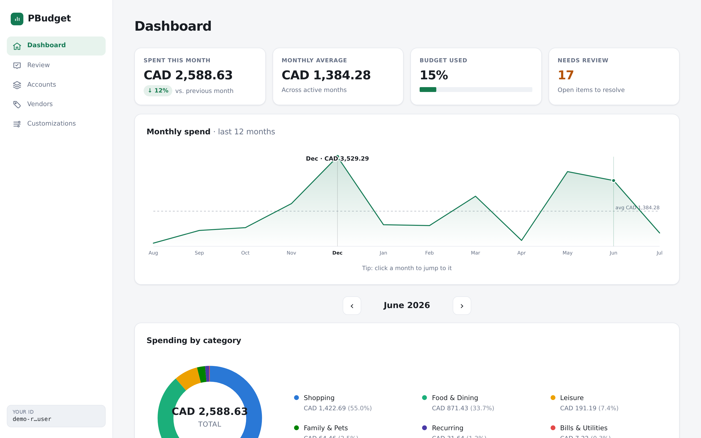
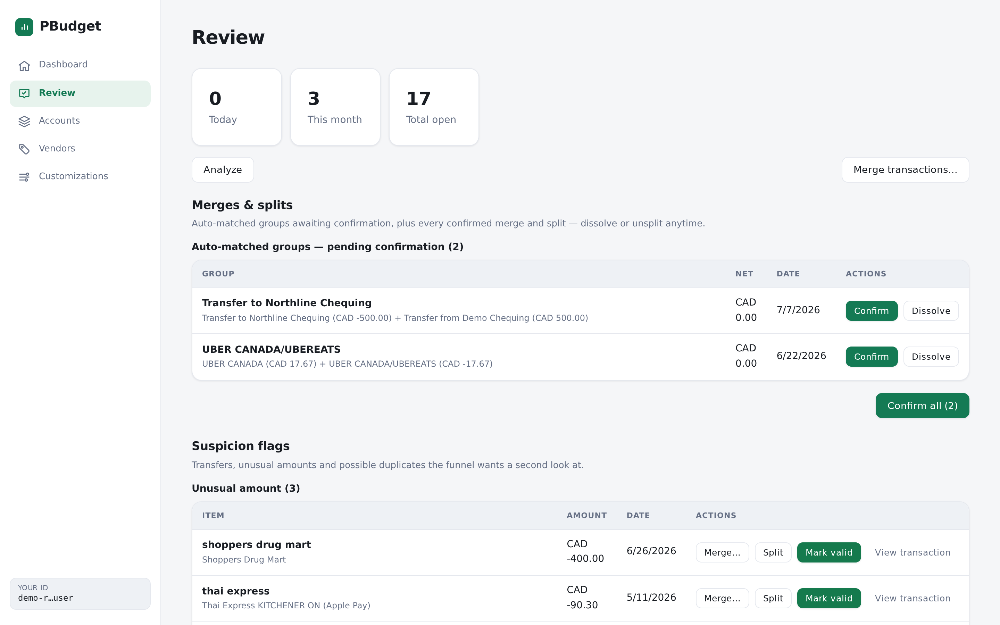
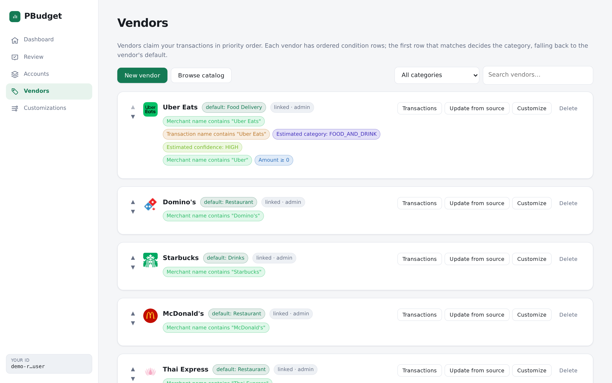
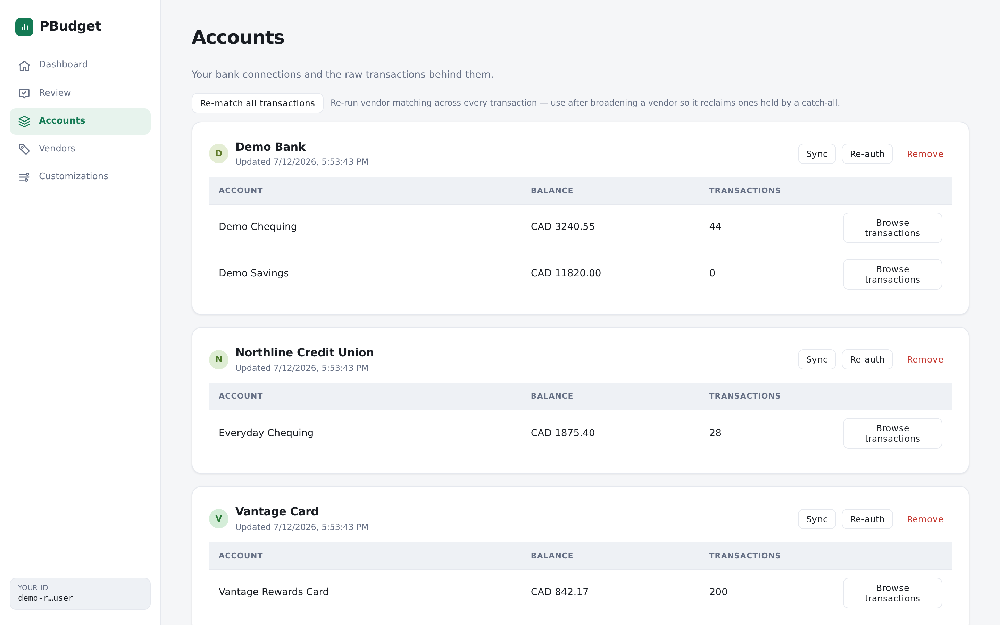

# PBudget

**A personal-finance budget ledger that balances itself.** Connect your banks
through [Plaid](https://plaid.com), and PBudget automatically categorizes, merges,
and reconciles every transaction into a monthly budget you can actually trust —
fully bilingual in English and 简体中文.

### ▶︎ [Live app — pbudget.ppvnx.com](https://pbudget.ppvnx.com/)

**Try the demo** (real, PII-scrubbed data — poke around, nothing to install):

| | |
|-----|-----|
| **URL** | <https://pbudget.ppvnx.com/login> |
| **Email** | `demo@ppvnx.com` |
| **Password** | `PlaidBudgetDemo2026!` |

> A shared account preloaded with synthetic data — explore freely.

---



## What it does

- **Connect banks** via Plaid Link and sync 180 days of accounts + transactions —
  across as many institutions as your plan allows.
- **Auto-categorize** with *vendor rules*: ordered condition rows (merchant name,
  amount, Plaid category, channel…) claim transactions in priority order. Write a
  rule once and it sorts every matching charge, past and future. Popular rules are
  shared through a community catalog.
- **Auto-merge & reconcile**: opposite, equal-amount transactions within a few days
  collapse into net-zero groups — refunds against their charge, and **self-transfers
  between your own accounts** — so they never double-count your spend.
- **Review queue**: everything unmatched, duplicated, unusually large, or transfer-like
  lands in one place to confirm or dismiss.
- **Budget vs. actual**: monthly spend per category against your budget, with a
  12-month trend, top vendors, and inline budget editing.
- **Accounts, auth & billing**: email/password auth with a verification step,
  Stripe subscriptions, and native iOS/Android apps (App Store + Play Billing).

## Screenshots

| Review — auto-merges & suspicion flags | Vendor rules | Accounts |
|---|---|---|
|  |  |  |

## Pricing

Priced per Plaid **connection** (one bank login):

| Plan | Price | Connections |
|------|-------|-------------|
| Free trial | $0 (first month) | 1 |
| Pro | $3 / mo | 6 |
| Max | $10 / mo | 20 |

## Stack

Next.js 14 (App Router) · React 18 · Prisma 6 · SQLite (dev) → PostgreSQL (prod) ·
[Plaid](https://plaid.com) Node SDK · [Stripe](https://stripe.com) · Capacitor
(iOS/Android) · nodemailer. Transaction and account PII is **encrypted at rest**
(AES-256-GCM). **Requires Node ≥ 18.**

## Local development

```bash
nvm use 22
cp .env.example .env          # then fill in the values (see below)
npm install
npm run db:push               # create the SQLite schema
npm run dev                   # http://localhost:5300  (reserved port)
```

Sign up, then open the verification link — in local dev without SMTP configured,
it is **printed to the server console** instead of emailed.

### Environment (`.env`)

See [`.env.example`](.env.example) for the full annotated list. The essentials:

| Var | Purpose |
|-----|---------|
| `DATABASE_URL` | `file:./dev.db` for SQLite; a Postgres URL in prod |
| `APP_ENCRYPTION_KEY` | base64 32-byte key; encrypts Plaid tokens + PII at rest. Generate: `node -e "console.log(require('crypto').randomBytes(32).toString('base64'))"` |
| `PLAID_CLIENT_ID`, `PLAID_SECRET`, `PLAID_ENV`, `PLAID_COUNTRY_CODES` | Plaid API access |
| `STRIPE_SECRET_KEY`, `STRIPE_WEBHOOK_SECRET`, `STRIPE_PRICE_PRO`, `STRIPE_PRICE_MAX` | Billing — one recurring price id per paid tier |
| `SMTP_*`, `EMAIL_FROM` | Verification emails (optional in dev) |

Point your Stripe webhook at `POST /api/stripe/webhook`
(`checkout.session.completed`, `customer.subscription.*`).

## SQLite → Postgres

Switch `provider` in `prisma/schema.prisma` from `sqlite` to `postgresql` and point
`DATABASE_URL` at Postgres — no query changes, since all DB access goes through Prisma.

## License

PBudget is free software licensed under the **GNU Affero General Public License v3.0
or later** — see [LICENSE](LICENSE). If you run a modified version as a network
service, the AGPL requires you to offer its source to your users.

© 2026 Leo Zhu.
